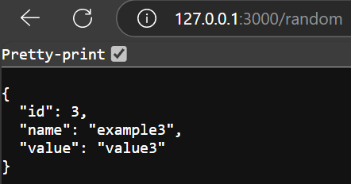

# OSProject Running Containers for Application Development

Group Name: Ahmad. 

Section: 6. 

Team Mates:
1. __Sofwan bin Aliza__ , __2224483__
2. __Firdaus Muhammad Salman__ , __2223281__
3. __Fill name__ and __matric no__

## Rules
1. You are allowed to have **3 group** members. *Exception* is allowed **IFF (if and only if)** you are allowed to have 4 group members if you are a **multinational** or a **multigender** group. 
2. When you complete the project, make sure to submit the repository link of your cloned project. Make sure all the files are as what you aspect in your repository. 
3. Answer all questions in the **README.md**, in your own repository. Either use the online VSCode, terminal or github to edit. Answers are expected where you see __Fill answer here__.
4. Learn how to use markdown. https://www.w3schools.io/file/markdown-introduction/

## Forking this OS project repository
1. First thing you need in doing this project is to have a github account. Make sure to sign up at https://www.github.com
2. The second thing you need is to fork the OS project repository in your own github account. 

    1. Go to https://github.com/joeynor/OSProject and click fork to copy the project into your own repository
    2. Make sure that the new fork is now in your own repository

***Questions:***

1. What is the link of the fork OSProject in your repository. ***(1 mark)*** __https://github.com/SfwanA/OSProject-Ahmad-.git__.
2. How many files and folders are in this repository. ***(1 mark)*** __At start, 1 folder and 7 files__.


## Exploring github codespaces

1. The next thing that we will be doing is exploring codespaces. First of all, read about codespaces https://docs.github.com/en/codespaces/overview#what-is-a-codespace
2. Then go to the link https://github.com/codespaces and we shall start a new codespace.  
3. Click on ***New codespace***.
4. Choose your own OSProject repository to start your codespace.

 

5. Once you have created you codespace, you will see the following. You might already be familiar with this, since it will look similar to VSCode. 

 

6. You will see the [README file](./README.md) file. One is a preview of how it looks like on the web, and the other is the editing view in markdown language. 
7. Edit the [README file](./README.md). Make sure you have your group details correct, ie, group name, section and team members along with their matric IDs. 
8. Once you have finish editing, click File->Save or ***ctrl-s*** to save it. 
9. After saving, you will notice an M or U next to your file. You will need to commit any changes, whenever you make changes so that it is uploaded to the github repository. 

 

10. Click on the source control, hint: its on the left side panel, and it will list down the files that have been modified or updated. Click on commit. It will then ask you "Would you like to stage all your changes and commit them directly?" Just say yes, and a new tab will appear. Type a message to log what you have done, and click on the check mark. 

 

11. After that, sync the changes to the main repository. 
12. Make sure to commit and sync your files to the main repository, or else, your work will be lost since it is not saved into the main repository when you submit your project.

***Questions:***

1. What is default OS used to run the virtual environment for codespaces. ***(1 mark)*** __Linux ubuntu__.
   
2. What are the two options of ram, disk and vcpu configuration you can have in running codespaces . ***(1 mark)***
__Standard: 2-core vCPU, 4 GB RAM, 32 GB storage.
Premium: 4-core vCPU, 8 GB RAM, 64 GB storage.__.

3. Why must we commit and sync our current work on source control? ***(1 mark)***
__To persist changes, prevent data loss, enable collaboration, and ensure the work is backed up and versioned__.

## Exploring the Terminal

1. Look at the TERMINAL tab. Explore and run commands according to the questions below. 
2. You can include your answers as images, or cut and paste the output here. If you are cutting and pasting your answers, wrap your answers in the codeblock clause in markdown. For example, if i run the command **whoami** the the output would look like the one below.
```bash
@joeynor ➜ /workspaces/OSProject (main) $ whoami 
codespace
```


***Questions:***

Look at the TERMINAL tab. Run the following commands and provide the output here. 

1. Run the command **pwd** . ***(1 mark)***
```bash
@salmanfrds ➜ / $ pwd
/
```
2. Run the command **cat /etc/passwd** . ***(1 mark)*** 
```bash
@salmanfrds ➜ / $ cat /etc/passwd
root:x:0:0:root:/root:/bin/bash
daemon:x:1:1:daemon:/usr/sbin:/usr/sbin/nologin
bin:x:2:2:bin:/bin:/usr/sbin/nologin
sys:x:3:3:sys:/dev:/usr/sbin/nologin
sync:x:4:65534:sync:/bin:/bin/sync
games:x:5:60:games:/usr/games:/usr/sbin/nologin
man:x:6:12:man:/var/cache/man:/usr/sbin/nologin
lp:x:7:7:lp:/var/spool/lpd:/usr/sbin/nologin
mail:x:8:8:mail:/var/mail:/usr/sbin/nologin
news:x:9:9:news:/var/spool/news:/usr/sbin/nologin
uucp:x:10:10:uucp:/var/spool/uucp:/usr/sbin/nologin
proxy:x:13:13:proxy:/bin:/usr/sbin/nologin
www-data:x:33:33:www-data:/var/www:/usr/sbin/nologin
backup:x:34:34:backup:/var/backups:/usr/sbin/nologin
list:x:38:38:Mailing List Manager:/var/list:/usr/sbin/nologin
irc:x:39:39:ircd:/var/run/ircd:/usr/sbin/nologin
gnats:x:41:41:Gnats Bug-Reporting System (admin):/var/lib/gnats:/usr/sbin/nologin
nobody:x:65534:65534:nobody:/nonexistent:/usr/sbin/nologin
_apt:x:100:65534::/nonexistent:/usr/sbin/nologin
systemd-timesync:x:101:101:systemd Time Synchronization,,,:/run/systemd:/usr/sbin/nologin
systemd-network:x:102:103:systemd Network Management,,,:/run/systemd:/usr/sbin/nologin
systemd-resolve:x:103:104:systemd Resolver,,,:/run/systemd:/usr/sbin/nologin
messagebus:x:104:105::/nonexistent:/usr/sbin/nologin
codespace:x:1000:1000::/home/codespace:/bin/bash
sshd:x:105:65534::/run/sshd:/usr/sbin/nologin
```
3. Run the command **df** . ***(1 mark)*** 
```bash
@salmanfrds ➜ / $ df
Filesystem     1K-blocks     Used Available Use% Mounted on
overlay         32847680 10706336  20447244  35% /
tmpfs              65536        0     65536   0% /dev
shm                65536        0     65536   0% /dev/shm
/dev/root       30298176 25448404   4833388  85% /vscode
/dev/sdc1       46127956 18735720  25016660  43% /tmp
/dev/loop4      32847680 10706336  20447244  35% /workspaces
```
4. Run the command **du** . ***(1 mark)***
```bash
@salmanfrds ➜ / $ sudo du -h / --max-depth=1  # Changed command to limit output length with --max-depth=1
4.0K    /mnt
602M    /opt
0       /sys
1.7G    /home
140K    /run
4.0K    /media
4.0K    /srv
29M     /var
6.2G    /usr
53M     /root
4.0K    /boot
0       /dev
3.3M    /etc
du: cannot access '/proc/13238/task/13238/fd/4': No such file or directory
du: cannot access '/proc/13238/task/13238/fdinfo/4': No such file or directory
du: cannot access '/proc/13238/fd/3': No such file or directory
du: cannot access '/proc/13238/fdinfo/3': No such file or directory
0       /proc
84K     /tmp
6.0G    /.codespaces
5.8G    /vscode
12G     /workspaces
143M    /go
32G     /  # Some directories require sudo access to avoid permission errors.
```
5. Run the command **ls** . ***(1 mark)***.
```bash
@salmanfrds ➜ / $ ls
bin   dev  go    lib    lib64   media  opt   root  sbin  sys  usr  vscode
boot  etc  home  lib32  libx32  mnt    proc  run   srv   tmp  var  workspaces
```
6. Run the command **ls -asl** . ***(1 mark)***.
```bash
@salmanfrds ➜ / $ ls -asl
total 92
4 drwxr-xr-x    1 root      root   4096 Jan 20 13:05 .
4 drwxr-xr-x    1 root      root   4096 Jan 20 13:05 ..
4 drwxr-xr-x    3 root      root   4096 Jan 20 13:05 .codespaces
0 -rwxr-xr-x    1 root      root      0 Jan 20 13:05 .dockerenv
0 lrwxrwxrwx    1 root      root      7 Oct 11 02:03 bin -> usr/bin
4 drwxr-xr-x    2 root      root   4096 Apr 15  2020 boot
0 drwxr-xr-x   13 root      root   3900 Jan 24 18:16 dev
8 drwxr-xr-x    1 root      root   4096 Jan 20 13:06 etc
4 drwxrwsr-x    3 codespace golang 4096 Dec 12 22:27 go
8 drwxr-xr-x    1 root      root   4096 Jan 20 13:05 home
0 lrwxrwxrwx    1 root      root      7 Oct 11 02:03 lib -> usr/lib
0 lrwxrwxrwx    1 root      root      9 Oct 11 02:03 lib32 -> usr/lib32
0 lrwxrwxrwx    1 root      root      9 Oct 11 02:03 lib64 -> usr/lib64
0 lrwxrwxrwx    1 root      root     10 Oct 11 02:03 libx32 -> usr/libx32
4 drwxr-xr-x    2 root      root   4096 Oct 11 02:03 media
4 drwxr-xr-x    2 root      root   4096 Oct 11 02:03 mnt
4 drwxrwsr-x    1 codespace oryx   4096 Jan 20 13:05 opt
0 dr-xr-xr-x  221 root      root      0 Jan 24 18:16 proc
8 drwx------    1 root      root   4096 Dec 12 22:29 root
4 drwxr-xr-x    1 root      root   4096 Jan 24 18:17 run
0 lrwxrwxrwx    1 root      root      8 Oct 11 02:03 sbin -> usr/sbin
4 drwxr-xr-x    2 root      root   4096 Oct 11 02:03 srv
0 dr-xr-xr-x   12 root      root      0 Jan 24 18:13 sys
4 drwxr-xrwt+   3 root      root   4096 Jan 24 18:17 tmp
8 drwxr-xr-x    1 root      root   4096 Dec 12 22:13 usr
8 drwxr-xr-x    1 root      root   4096 Jan 20 13:05 var
4 drwxr-xr-x    5 root      root   4096 Jan 24 18:14 vscode
4 drwxr-xrwx+   5 codespace root   4096 Jan 20 13:06 workspaces
```
7. Run the command **free -h** . ***(1 mark)***.
```bash
@salmanfrds ➜ / $ free -h
              total        used        free      shared  buff/cache   available
Mem:          7.7Gi       2.1Gi       276Mi        61Mi       5.3Gi       5.2Gi
Swap:            0B          0B          0B
```
8. Run the command **cat /proc/cpuinfo** . ***(1 mark)***.
```bash
@salmanfrds ➜ / $ cat /proc/cpuinfo
processor       : 0
vendor_id       : AuthenticAMD
cpu family      : 25
model           : 1
model name      : AMD EPYC 7763 64-Core Processor
stepping        : 1
microcode       : 0xffffffff
cpu MHz         : 3012.612
cache size      : 512 KB
physical id     : 0
siblings        : 2
core id         : 0
cpu cores       : 1
apicid          : 0
initial apicid  : 0
fpu             : yes
fpu_exception   : yes
cpuid level     : 13
wp              : yes
flags           : fpu vme de pse tsc msr pae mce cx8 apic sep mtrr pge mca cmov pat pse36 clflush mmx fxsr sse sse2 ht syscall nx mmxext fxsr_opt pdpe1gb rdtscp lm constant_tsc rep_good nopl tsc_reliable nonstop_tsc cpuid extd_apicid aperfmperf pni pclmulqdq ssse3 fma cx16 pcid sse4_1 sse4_2 movbe popcnt aes xsave avx f16c rdrand hypervisor lahf_lm cmp_legacy svm cr8_legacy abm sse4a misalignsse 3dnowprefetch osvw topoext invpcid_single vmmcall fsgsbase bmi1 avx2 smep bmi2 erms invpcid rdseed adx smap clflushopt clwb sha_ni xsaveopt xsavec xgetbv1 xsaves clzero xsaveerptr rdpru arat npt nrip_save tsc_scale vmcb_clean flushbyasid decodeassists pausefilter pfthreshold v_vmsave_vmload umip vaes vpclmulqdq rdpid fsrm
bugs            : sysret_ss_attrs null_seg spectre_v1 spectre_v2 spec_store_bypass srso
bogomips        : 4890.85
TLB size        : 2560 4K pages
clflush size    : 64
cache_alignment : 64
address sizes   : 48 bits physical, 48 bits virtual
power management:

processor       : 1
vendor_id       : AuthenticAMD
cpu family      : 25
model           : 1
model name      : AMD EPYC 7763 64-Core Processor
stepping        : 1
microcode       : 0xffffffff
cpu MHz         : 3006.725
cache size      : 512 KB
physical id     : 0
siblings        : 2
core id         : 0
cpu cores       : 1
apicid          : 1
initial apicid  : 1
fpu             : yes
fpu_exception   : yes
cpuid level     : 13
wp              : yes
flags           : fpu vme de pse tsc msr pae mce cx8 apic sep mtrr pge mca cmov pat pse36 clflush mmx fxsr sse sse2 ht syscall nx mmxext fxsr_opt pdpe1gb rdtscp lm constant_tsc rep_good nopl tsc_reliable nonstop_tsc cpuid extd_apicid aperfmperf pni pclmulqdq ssse3 fma cx16 pcid sse4_1 sse4_2 movbe popcnt aes xsave avx f16c rdrand hypervisor lahf_lm cmp_legacy svm cr8_legacy abm sse4a misalignsse 3dnowprefetch osvw topoext invpcid_single vmmcall fsgsbase bmi1 avx2 smep bmi2 erms invpcid rdseed adx smap clflushopt clwb sha_ni xsaveopt xsavec xgetbv1 xsaves clzero xsaveerptr rdpru arat npt nrip_save tsc_scale vmcb_clean flushbyasid decodeassists pausefilter pfthreshold v_vmsave_vmload umip vaes vpclmulqdq rdpid fsrm
bugs            : sysret_ss_attrs null_seg spectre_v1 spectre_v2 spec_store_bypass srso
bogomips        : 4890.85
TLB size        : 2560 4K pages
clflush size    : 64
cache_alignment : 64
address sizes   : 48 bits physical, 48 bits virtual
power management:
```
9. Run the command **top** and type **q** to quit. ***(1 mark)***.
```bash
top - 18:37:14 up 23 min,  0 users,  load average: 0.14, 0.78, 1.53
Tasks:  18 total,   1 running,  17 sleeping,   0 stopped,   0 zombie
%Cpu(s):  4.4 us,  5.2 sy,  0.0 ni, 89.7 id,  0.2 wa,  0.0 hi,  0.5 si,  0.0 st
MiB Mem :   7929.6 total,    286.5 free,   2176.8 used,   5466.2 buff/cache
MiB Swap:      0.0 total,      0.0 free,      0.0 used.   5376.4 avail Mem 

    PID USER      PR  NI    VIRT    RES    SHR S  %CPU  %MEM     TIME+ COMMAND                                                       
    937 codespa+  20   0   42.0g 907164  50816 S   2.7  11.2   1:17.39 node                                                          
    611 codespa+  20   0   11.3g  97024  47488 S   1.3   1.2   0:08.67 node                                                          
    696 codespa+  20   0   11.4g 205308  43648 S   0.3   2.5   0:45.94 node                                                          
      1 codespa+  20   0    1136    128    128 S   0.0   0.0   0:00.04 docker-init                                                   
      7 codespa+  20   0    7236   1664   1664 S   0.0   0.0   0:00.02 sleep                                                         
     35 root      20   0   12196   3608   2688 S   0.0   0.0   0:00.00 sshd                                                          
    430 codespa+  20   0    2616   1408   1408 S   0.0   0.0   0:00.01 sh                                                            
    456 root      20   0    2616   1280   1280 S   0.0   0.0   0:00.00 sh                                                            
    602 codespa+  20   0    2624   1536   1536 S   0.0   0.0   0:00.00 sh                                                            
   1225 codespa+  20   0   11.1g  71412  44672 S   0.0   0.9   0:03.12 node                                                          
   1789 root      20   0 1983004  79988  53120 S   0.0   1.0   0:00.22 dockerd                                                       
```
10. Run the command **uname -a**. ***(1 mark)***.
```bash
@salmanfrds ➜ / $ uname -a
Linux codespaces-96d9b0 6.5.0-1025-azure #26~22.04.1-Ubuntu SMP Thu Jul 11 22:33:04 UTC 2024 x86_64 x86_64 x86_64 GNU/Linux
```
11. What is the available free memory in the system. ***(1 mark)***. __Output of question no 7 shows that the available free memory of the system is 5.2 Gigabytes__.

12. What is the available disk space mounted on /workspace. ***(1 mark)***.
```
@salmanfrds ➜ / $ df -h /workspaces
Filesystem      Size  Used Avail Use% Mounted on
/dev/loop4       32G   11G   20G  35% /workspaces

Based on the output, it shows that the available disk space is 20GB, 35% of the disk size is used, and the remaining 65% is free space
```
13. Name the version and hardware architecture of the linux Virtual environment. ***(1 mark)*** __Based on the output of question no 10, it shows that version of the Linux kernel is 6.5.0-1025-azure, and the hardware architecture is x86_64.__

14. What is the difference between **ls** vs **ls -asl**. ***(1 mark)***.
```
Based on the output of question no 5 and 6, ls means lists all the file in the current directory, while a means all files including the hidden one, s means display the size, and l means provides detailed listing, which includes file permissions, number of links, owner, group, file size, modification date, and filename.

to conclude, ls lists file names, while ls -asl shows detailed info, including hidden files and sizes.
```
15. What is the TLB size of the Virtual CPU. ***(1 mark)***. __Based on the output of question no 8, there are two processors, and both processors (processor 0 and processor 1) TLB size is 2560 4K pages__

16. What is the CPU speed of the Virtual CPU. ***(1 mark)***. __Based on the output of question no 8, CPU speed is listed as 3012.612 MHz for processor 0 and 3006.725 MHz for processor 1__

17. What is the top running process that consumes the most CPU cycles. ***(1 mark)***. __Based on the output of question no 9, it shows that the top running process that consumes most of the cpu is process with PID 937 which consume 2.7% of the CPU__

## Running your own container instance.

1. At the terminal, run a linux instance. By typing the following command. 
```
docker pull debian
docker run --detach -it debian
```
2. This will run the debian container. To check if the debian container is running, type
```bash
@joeynor ➜ /workspaces/OSProject (main) $ docker ps -a
CONTAINER ID   IMAGE     COMMAND   CREATED         STATUS         PORTS     NAMES
f65be1987f84   debian    "bash"    4 minutes ago   Up 4 minutes             romantic_jackson
```

3. Keep note of the name used by your container, this is usually given random names unless you specify your own name. Now run a bash command on the container. Make sure you use the name of your container instead of the one shown here. 
```bash
docker exec -i -t romantic_jackson /bin/bash
```

4. Create a file on the container. First you must make sure you are in the bash command prompt of the container. The container is new, and does not have any software other than the debian OS. To create a new file, you will need an editor installed. In the bash shell of the container, run the package manager apt-get to install nano text editor. 

```bash
root@f65be1987f84:~# apt-get update      

root@f65be1987f84:~# apt-get install nano

root@f65be1987f84:~# cd /root

root@f65be1987f84:~# nano helloworld.txt
```

5. Edit your helloworld.txt, create your messsage and save by typing ctrl-X. Once saved, explore using the container to see where the file is located. Then exit the shell, by typing **exit**.

6. Stop the container and run **docker ps -a**, and restart the container again. Is your file in the container still available?
```bash 
@joeynor ➜ /workspaces/OSProject (main) $ docker stop romantic_jackson

@joeynor ➜ /workspaces/OSProject (main) $ docker ps -a
CONTAINER ID   IMAGE     COMMAND   CREATED          STATUS                        PORTS     NAMES
f65be1987f84   debian    "bash"    19 minutes ago   Exited (137) 18 seconds ago             romantic_jackson

@joeynor ➜ /workspaces/OSProject (main) $ docker restart romantic_jackson
```

7. Stop the container and delete the container. What happened to your helloworld.txt?

```bash 
@joeynor ➜ /workspaces/OSProject (main) $ docker stop romantic_jackson

@joeynor ➜ /workspaces/OSProject (main) $ docker ps -a
CONTAINER ID   IMAGE     COMMAND   CREATED          STATUS                        PORTS     NAMES
f65be1987f84   debian    "bash"    19 minutes ago   Exited (137) 18 seconds ago             romantic_jackson

@joeynor ➜ /workspaces/OSProject (main) $ docker rm romantic_jackson
```

***Questions:***

1. Are files in the container persistent. Why not?. ***(1 mark)*** __Files in Docker containers are not persistent by default. This is because containers use a layered filesystem where changes (e.g., new files) are stored in a temporary writable layer. When a container is stopped, the filesystem persists and can be restarted. However, if the container is removed, this temporary layer is destroyed, and all files are lost.__.
   
2. Can we run two, or three instances of debian linux? . ***(1 mark)*** __Let's test it!__.
```bash
@SfwanA ➜ /workspaces/OSProject-Ahmad- (main) $ docker ps -a
CONTAINER ID   IMAGE     COMMAND   CREATED   STATUS    PORTS     NAMES
@SfwanA ➜ /workspaces/OSProject-Ahmad- (main) $ docker run --detach -it --name container1 debian
d383117442bdb08e052fd0e742ae3bbfe3e475da79e72409cd17d81c84dfc631
@SfwanA ➜ /workspaces/OSProject-Ahmad- (main) $ docker run --detach -it --name container2 debia
n
dd60617d789dbef4e7b5e5b91ecd85f3dd574e5fbb8910096d3e42af02eef7fc
@SfwanA ➜ /workspaces/OSProject-Ahmad- (main) $ docker run --detach -it --name container3 debia
n
989065aa878315d98e0595d141030de289f3676011dc9950edbaa774d3e882fb
@SfwanA ➜ /workspaces/OSProject-Ahmad- (main) $ docker ps -a
CONTAINER ID   IMAGE     COMMAND   CREATED          STATUS          PORTS     NAMES
989065aa8783   debian    "bash"    12 seconds ago   Up 11 seconds             container3
dd60617d789d   debian    "bash"    16 seconds ago   Up 15 seconds             container2
d383117442bd   debian    "bash"    22 seconds ago   Up 21 seconds             container1
```
__Based on the above, it can run multiple instances of debian linux!__

## Running your own container with persistent storage

1. In the previous experiment, you might have notice that containers are not persistent. To make storage persistent, you will need to mount them. 
At the terminal, create a new directory called **myroot**, and run a instance of debian linux and mount myroot to the container. Find out the exact path of my root, and mount it as the root folder in the debian container. 
2. Create a file in /root on the container, the files should also appear in myroot of your host VM.

```bash 
@joeynor ➜ /workspaces/OSProject (main) $ mkdir myroot
@joeynor ➜ /workspaces/OSProject (main) $ cd myroot/
@joeynor ➜ /workspaces/OSProject/myroot (main) $ pwd
/workspaces/OSProject/myroot

@joeynor ➜ /workspaces/OSProject/myroot (main) $ docker run --detach -it -v /workspaces/OSProject/myroot:/root debian
```

***Questions:***

1. Check the permission of the files created in myroot, what user and group is the files created in docker container on the host virtual machine? . ***(2 mark)*** __The file helloworld.txt is owned by root:root inside the container__.
   
```bash
@SfwanA ➜ /workspaces/OSProject-Ahmad-/myroot (main) $ docker exec -i -t modest_leakey /bin/bash
root@c03035df724f:/# ls -l /root
total 4
-rw-rw-rw- 1 root root 13 Jan 25 15:40 helloworld.txt
```

2. Can you change the permission of the files to user codespace.  You will need this to be able to commit and get points for this question. ***(2 mark)***


```bash
@SfwanA ➜ /workspaces/OSProject-Ahmad-/myroot (main) $ cd ..
@SfwanA ➜ /workspaces/OSProject-Ahmad- (main) $ ls -l /workspaces/OSProject-Ahmad-/myroot
total 4
-rw-rw-rw- 1 root root 14 Jan 25 16:04 helloworld.txt
@SfwanA ➜ /workspaces/OSProject-Ahmad- (main) $ sudo chown -R codespace:codespace myroot
@SfwanA ➜ /workspaces/OSProject-Ahmad- (main) $ ls -l /workspaces/OSProject-Ahmad-/myroot
total 4
-rw-rw-rw- 1 codespace codespace 14 Jan 25 16:04 helloworld.txt
```
*** __Based on the above, permission can be changed__.***

## You are on your own, create your own static webpage

1. Create a directory called webpage in your host machine
2. Inside the directory, create a page index.html, with any content you would like
3. Then, run the apache webserver and mount the webpage directory to it. Hint:
```bash
## the -p 8080:80 flag points the host port 8080 to the container port 80

docker run --detach -v /workspaces/OSProject/webpage:/usr/local/apache2/htdocs/ -p 8080:80 httpd
```

4. If it works, codespace will trigger a port assignment and provide a URL for you to access your webpage like the one below.

 


5. You can also see the Port in the **PORTS** tab, next to the terminal tab.

6. You can then access your website by adding an index.html towards the end of your url link, like the one below. 

 

***Questions:***

1. What is the permission of folder /usr/local/apache/htdocs and what user and group owns the folder? . ***(2 mark)*** __Permissions: drwxr-xr-x , User and Group: 1000:1000__.
```bash
@SfwanA ➜ /workspaces/OSProject-Ahmad- (main) $ docker exec beautiful_stonebraker ls -ld /usr/local/apache2/htdocs
drwxrwxrwx+ 2 1000 1000 4096 Jan 25 16:15 /usr/local/apache2/htdocs
```
2. What port is the apache web server running. ***(1 mark)*** __The Apache web server inside the Docker container is running on port 80__.
```bash
@SfwanA ➜ /workspaces/OSProject-Ahmad- (main) $ docker ps
CONTAINER ID   IMAGE     COMMAND              CREATED          STATUS          PORTS                                     NAMES
fd888d7557bd   httpd     "httpd-foreground"   9 minutes ago    Up 9 minutes    0.0.0.0:8080->80/tcp, [::]:8080->80/tcp   beautiful_stonebraker
```
3. What port is open for http protocol on the host machine? ***(1 mark)*** __Based on the bash above, the port open for HTTP protocol on the host machine is 8080__.

## Create SUB Networks

1. In docker, you can create your own private networks where you can run multiple services, in this part, we will create two networks, one called bluenet and the other is rednet
2. Run the docker create network to create you networks like the ones below
```bash
## STEP 1:
## Create Networks ##
docker network create bluenet
docker network create rednet`

## STEP 2: (automatically running)
## Create (1) Container in background called "c1" running busybox image ##
docker run -itd --net bluenet --name c1 busybox sh
docker run -itd --net rednet --name c2 busybox sh
```
***Questions:***

1. Describe what is busybox and what is command switch **--name** is for? . ***(2 mark)*** __BusyBox is commonly used as a base image for containers that require basic shell/command-line functionality without the overhead of a full OS.
--name assigns a custom name to a container__.

2. Explore the network using the command ```docker network ls```, show the output of your terminal. ***(1 mark)*** __Output below__.
```bash
@SfwanA ➜ /workspaces/OSProject-Ahmad- (main) $ docker network ls
NETWORK ID     NAME      DRIVER    SCOPE
7d58b76c0756   bluenet   bridge    local
5328f37aae3c   bridge    bridge    local
083048829d19   host      host      local
9e5f9cabdb39   none      null      local
415a62dff7b9   rednet    bridge    local
```

3. Using ```docker inspect c1``` and ```docker inspect c2``` inscpect the two network. What is the gateway of bluenet and rednet.? ***(1 mark)***
__Bluenet: 172.18.0.1, Rednet: 172.19.0.1__.

4. What is the network address for the running container c1 and c2? ***(1 mark)***
__Container c1 (bluenet):
IP Address: 172.18.0.2
Subnet: 172.18.0.0/16
Container c2 (rednet):
IP Address: 172.19.0.2
Subnet: 172.19.0.0/16__.
   
5. Using the command ```docker exec c1 ping c2```, which basically tries to do a ping from container c1 to c2. Are you able to ping? Show your output . ***(1 mark)***
```bash
@SfwanA ➜ /workspaces/OSProject-Ahmad- (main) $ docker exec c1 ping c2
ping: bad address 'c2'
```

## Bridging two SUB Networks
1. Let's try this again by creating a network to bridge the two containers in the two subnetworks
```
docker network create bridgenet
docker network connect bridgenet c1
docker network connect bridgenet c2
docker exec c1 ping c2
```
***Questions:***

1. Are you able to ping? Show your output . ***(1 mark)***
__Yes, see below__.
```bash
@SfwanA ➜ /workspaces/OSProject-Ahmad- (main) $ docker exec c1 ping c2
PING c2 (172.20.0.3): 56 data bytes
64 bytes from 172.20.0.3: seq=0 ttl=64 time=0.127 ms
64 bytes from 172.20.0.3: seq=1 ttl=64 time=0.080 ms
64 bytes from 172.20.0.3: seq=2 ttl=64 time=0.089 ms
64 bytes from 172.20.0.3: seq=3 ttl=64 time=0.075 ms
64 bytes from 172.20.0.3: seq=4 ttl=64 time=0.089 ms
64 bytes from 172.20.0.3: seq=5 ttl=64 time=0.065 ms
64 bytes from 172.20.0.3: seq=6 ttl=64 time=0.098 ms
64 bytes from 172.20.0.3: seq=7 ttl=64 time=0.075 ms
64 bytes from 172.20.0.3: seq=8 ttl=64 time=0.079 ms
64 bytes from 172.20.0.3: seq=9 ttl=64 time=0.077 ms
```
2. What is different from the previous ping in the section above? ***(1 mark)***
__Previous Ping: Failed with ping: bad address 'c2' because c1 and c2 were on isolated networks (bluenet and rednet).
Current Ping: Succeeds because both containers are now connected to the same network (bridgenet), enabling DNS resolution and direct communication.__.

## Intermediate Level (10 marks bonus)

### Node.js and MySQL in Docker Containers

This guide will help you set up a simple Node.js website that retrieves a random row from a MySQL database. Both the MySQL server and the Node.js server will run in separate Docker containers on two separate networks. Your job is to make it work by making the two containers in two separate network bridged together.

#### Step 1: Set Up the Docker Network

Create a Docker network to for the two containers.
For mysql, call it **mysqlnet** for nodejs call it **nodejsnet** .

#### Step 2: Set Up the MySQL Container

Run a MySQL container on the created network.

```sh
docker run --name mysql-container --network mysqlnet -e MYSQL_ROOT_PASSWORD=rootpassword -e MYSQL_DATABASE=mydatabase -e MYSQL_USER=myuser -e MYSQL_PASSWORD=mypassword -d mysql:latest
```

#### Step 3: Set Up the Node.js Container

1. **Create a directory for your Node.js application and initialize it.**

    ```sh
    mkdir nodejs-app
    cd nodejs-app
    npm init -y
    npm install express mysql
    ```

2. **Create a file named `index.js` with the following content:**

    ```js
    const express = require('express');
    const mysql = require('mysql');

    const app = express();
    const port = 3000;

    // Create a MySQL connection
    const connection = mysql.createConnection({
      host: 'mysql-container',
      user: 'myuser',
      password: 'mypassword',
      database: 'mydatabase'
    });

    // Connect to MySQL
    connection.connect((err) => {
      if (err) {
        console.error('Error connecting to MySQL:', err);
        return;
      }
      console.log('Connected to MySQL');
    });

    // Define a route to get a random row
    app.get('/random', (req, res) => {
      const query = 'SELECT * FROM mytable ORDER BY RAND() LIMIT 1';
      connection.query(query, (err, results) => {
        if (err) {
          console.error('Error executing query:', err);
          res.status(500).send('Server Error');
          return;
        }
        res.json(results[0]);
      });
    });

    // Start the server
    app.listen(port, () => {
      console.log(`Server running at http://localhost:${port}`);
    });
    ```

3. **Create a Dockerfile for the Node.js application:**

    ```Dockerfile
    # Use the official Node.js image
    FROM node:14

    # Create and change to the app directory
    WORKDIR /usr/src/app

    # Copy application dependency manifests to the container image
    COPY package*.json ./

    # Install production dependencies
    RUN npm install

    # Copy local code to the container image
    COPY . .

    # Run the web service on container startup
    CMD [ "node", "index.js" ]
    ```

#### Step 4: Build and Run the Node.js Container

1. **Build the Docker image for the Node.js application.**

    ```sh
    docker build -t nodejs-app .
    ```

2. **Run the Node.js container on the same network as the MySQL container.**

    ```sh
    docker run --name nodejs-container --network nodejsnet -p 3000:3000 -d nodejs-app
    ```

#### Step 5: Test the Setup

You can now test the setup by accessing the Node.js application in your browser or using a tool like `curl`:

```sh
curl http://localhost:3000/random
```

#### Step 6: Ensure `mytable` is Populated

Make sure you have created the `mytable` table and populated it with some data in your MySQL database for the above steps to work correctly.

You can use the following SQL commands to create and populate the table (run these commands in the MySQL container):

```sql
CREATE TABLE mytable (
  id INT AUTO_INCREMENT PRIMARY KEY,
  name VARCHAR(255) NOT NULL,
  value VARCHAR(255) NOT NULL
);

INSERT INTO mytable (name, value) VALUES ('example1', 'value1'), ('example2', 'value2'), ('example3', 'value3');
```

### Summary

You have now set up a Node.js application in a Docker container on nodejsnet netowrk and a MySQL database in another Docker container on mysqlnet network. Now bridge the two network together.

***Questions:***

1. What is the output of step 5 above, explain the error? ***(1 mark)*** __The output is a server error. The reason is that the network connection between the nodejs-container and mysql-container has not been established yet, so Express cannot find the MySQL address and responds with a server error (status 500)__.
```bash
@salmanfrds ➜ /workspaces/OSProject-Ahmad (main) $ curl http://localhost:3000/random
Server Error
```
```bash
@salmanfrds ➜ /workspaces/OSProject-Ahmad (main) $ docker logs nodejs-container 
Error connecting to MySQL: Error: getaddrinfo ENOTFOUND mysql-container
    at GetAddrInfoReqWrap.onlookup [as oncomplete] (dns.js:71:26)
    --------------------
    at Protocol._enqueue (/usr/src/app/node_modules/mysql/lib/protocol/Protocol.js:144:48)
    at Protocol.handshake (/usr/src/app/node_modules/mysql/lib/protocol/Protocol.js:51:23)
    at Connection.connect (/usr/src/app/node_modules/mysql/lib/Connection.js:116:18)
    at Object.<anonymous> (/usr/src/app/index.js:16:12)
    at Module._compile (internal/modules/cjs/loader.js:1114:14)
    at Object.Module._extensions..js (internal/modules/cjs/loader.js:1143:10)
    at Module.load (internal/modules/cjs/loader.js:979:32)
    at Function.Module._load (internal/modules/cjs/loader.js:819:12)
    at Function.executeUserEntryPoint [as runMain] (internal/modules/run_main.js:75:12)
    at internal/main/run_main_module.js:17:47 {
  errno: -3008,
  code: 'ENOTFOUND',
  syscall: 'getaddrinfo',
  hostname: 'mysql-container',
  fatal: true
}
```
2. Show the instruction needed to make this work. ***(1 mark)*** __Fill answer here__.
Login as root and add table into mysql 
```docker
@salmanfrds ➜ /workspaces/OSProject-Ahmad (main) $ docker exec -it mysql-container mysql -u root -p
Enter password:
Welcome to the MySQL monitor.  Commands end with ; or \g.
Your MySQL connection id is 9
Server version: 8.0.41 MySQL Community Server - GPL

Copyright (c) 2000, 2025, Oracle and/or its affiliates.

Oracle is a registered trademark of Oracle Corporation and/or its
affiliates. Other names may be trademarks of their respective
owners.

Type 'help;' or '\h' for help. Type '\c' to clear the current input statement.

mysql> use mydatabase
Reading table information for completion of table and column names
You can turn off this feature to get a quicker startup with -A

Database changed
mysql> CREATE TABLE mytable (
    ->   id INT AUTO_INCREMENT PRIMARY KEY,
    ->   name VARCHAR(255) NOT NULL,
    ->   value VARCHAR(255) NOT NULL
    -> );
ERROR 1050 (42S01): Table 'mytable' already exists
mysql> INSERT INTO mytable (name, value) VALUES ('example1', 'value1'), ('example2', 'value2'), ('example3', 'value3');
Query OK, 3 rows affected (0.01 sec)
Records: 3  Duplicates: 0  Warnings: 0

mysql> COMMIT;
```
Establish a bridged network between the nodejs-container and mysql-container and attempt to ping.
```docker
docker network create bridgednet
docker network connect bridgednet mysql-container
docker network connect bridgednet nodejs-container
docker network connect mysqlnet nodejs-container
docker network connect nodejsnet mysql-container

@salmanfrds ➜ /workspaces/OSProject-Ahmad (main) $ docker exec -it nodejs-container ping mysql-container
PING mysql-container (172.20.0.3) 56(84) bytes of data.
64 bytes from mysql-container.bridgednet (172.20.0.3): icmp_seq=1 ttl=64 time=0.063 ms
64 bytes from mysql-container.bridgednet (172.20.0.3): icmp_seq=2 ttl=64 time=0.065 ms
64 bytes from mysql-container.bridgednet (172.20.0.3): icmp_seq=3 ttl=64 time=0.066 ms
64 bytes from mysql-container.bridgednet (172.20.0.3): icmp_seq=4 ttl=64 time=0.065 ms
```
Even after that, the Node.js application is still unable to connect to the MySQL database, and it shows this error.
```bash
@salmanfrds ➜ /workspaces/OSProject-Ahmad (main) $ docker logs nodejs-container
Server running at http://localhost:3000
Error connecting to MySQL: Error: ER_NOT_SUPPORTED_AUTH_MODE: Client does not support authentication protocol requested by server; consider upgrading MySQL client
    at Handshake.Sequence._packetToError (/usr/src/app/node_modules/mysql/lib/protocol/sequences/Sequence.js:47:14)
    at Handshake.ErrorPacket (/usr/src/app/node_modules/mysql/lib/protocol/sequences/Handshake.js:123:18)
    at Protocol._parsePacket (/usr/src/app/node_modules/mysql/lib/protocol/Protocol.js:291:23)
    at Parser._parsePacket (/usr/src/app/node_modules/mysql/lib/protocol/Parser.js:433:10)
    at Parser.write (/usr/src/app/node_modules/mysql/lib/protocol/Parser.js:43:10)
    at Protocol.write (/usr/src/app/node_modules/mysql/lib/protocol/Protocol.js:38:16)
    at Socket.<anonymous> (/usr/src/app/node_modules/mysql/lib/Connection.js:88:28)
    at Socket.<anonymous> (/usr/src/app/node_modules/mysql/lib/Connection.js:526:10)
    at Socket.emit (events.js:400:28)
    at addChunk (internal/streams/readable.js:293:12)
    --------------------
    at Protocol._enqueue (/usr/src/app/node_modules/mysql/lib/protocol/Protocol.js:144:48)
    at Protocol.handshake (/usr/src/app/node_modules/mysql/lib/protocol/Protocol.js:51:23)
    at Connection.connect (/usr/src/app/node_modules/mysql/lib/Connection.js:116:18)
    at Object.<anonymous> (/usr/src/app/index.js:16:12)
    at Module._compile (internal/modules/cjs/loader.js:1114:14)
    at Object.Module._extensions..js (internal/modules/cjs/loader.js:1143:10)
    at Module.load (internal/modules/cjs/loader.js:979:32)
    at Function.Module._load (internal/modules/cjs/loader.js:819:12)
    at Function.executeUserEntryPoint [as runMain] (internal/modules/run_main.js:75:12)
    at internal/main/run_main_module.js:17:47 {
  code: 'ER_NOT_SUPPORTED_AUTH_MODE',
  errno: 1251,
  sqlMessage: 'Client does not support authentication protocol requested by server; consider upgrading MySQL client',
  sqlState: '08004',
  fatal: true
}
```  
The reason for this error is that MySQL is using password authentication with the caching_sha2_password plugin, which is not supported by the MySQL client. Therefore, it is important to change it to the mysql_native_password plugin for it to work. Additionally, we need to ensure that our version supports these plugins. In my case, I am using version 8.0 instead of the latest version because the latest one does not support the mysql_native_password plugin.
```docker
mysql> SELECT user, host, plugin FROM mysql.user;
+------------------+-----------+-----------------------+
| user             | host      | plugin                |
+------------------+-----------+-----------------------+
| myuser           | %         | caching_sha2_password |
| root             | %         | caching_sha2_password |
| mysql.infoschema | localhost | caching_sha2_password |
| mysql.session    | localhost | caching_sha2_password |
| mysql.sys        | localhost | caching_sha2_password |
| root             | localhost | caching_sha2_password |
+------------------+-----------+-----------------------+
6 rows in set (0.00 sec)

mysql> ALTER USER 'myuser'@'%' IDENTIFIED WITH mysql_native_password BY 'mypassword';
Query OK, 0 rows affected (0.01 sec)

mysql> FLUS PRIVILEGES;

mysql> COMMIT
    -> ;

mysql> SELECT VERSION();
+-----------+
| VERSION() |
+-----------+
| 8.0.41    |
+-----------+
1 row in set (0.00 sec)
```
To ensure the latest updates, we can restart both containers to apply everything.
```bash
docker restart mysql-container
docker restart nodejs-container
```
Finally, we can see the output, which is a random row of values from the table
```bash
@salmanfrds ➜ /workspaces/OSProject-Ahmad (main) $ curl http://localhost:3000/random
{"id":1,"name":"example1","value":"value1"}
```
 

## What to submit
1. Make sure to commit all changes on your source control, and make sure your source control is sync to the repository. 
2. Check your repository link, to see if all the files and answers are included in the repository. 
3. Submit through italeem, by providing the link to your repository.
4. Due by ***AS STATED IN ITALEEM SYSTEM***
